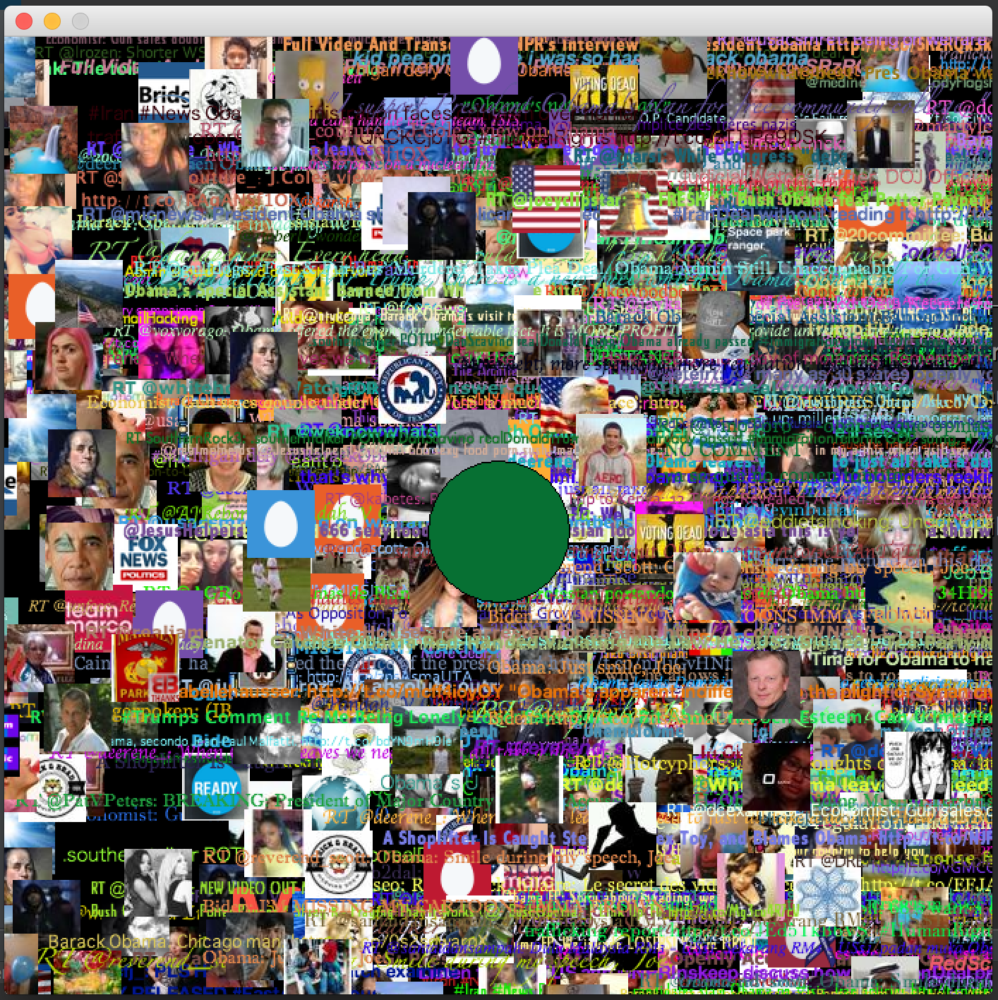

Este projeto de arte é uma visualização de dados sociais. A proposta desta obra é expressar o estado do consumo de informação dentro de uma web definida pelas leis da Web 2.0.

Detalhes técnicos:
  * Visualizações são baseado no [Processing Project](http://www.processing.org).
  * Visualizações são implantado como um "Java Applet" em dentro de um aplicativo de Java.

API's Externos:
  * [Twitter](http://apiwiki.twitter.com/)

Bibliotecas de Código Aberto Utilizados:
  * [JTwitter](http://www.winterwell.com/software/jtwitter.php) - Escrita em Java e desenvolvido por [Daniel Winterstein](http://www.winterwell.com/company/people.php)

**Em inglês:**

This art project is a social feed visualization written in Java. This art is meant to express the state of information consumption in a web defined by the laws of Web 2.0.

Technical Details:
  * Visualizations enabled by the [Processing Project](http://www.processing.org).
  * Visualization deployed as a Java applet embedded within a Java Application.

External API's Utilized:
  * [Twitter](http://apiwiki.twitter.com/)

Other Open Source Libraries Utilized:
  * [JTwitter](http://www.winterwell.com/software/jtwitter.php) - Twitter API Java Library developed by [Daniel Winterstein](http://www.winterwell.com/company/people.php)

To download the most recent executable jar, go here: https://drive.google.com/file/d/0B0FA5NymZcUYOTRPN1hSNjVSanM/edit?usp=sharing
